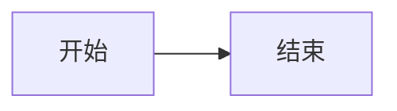

# Aisssky Blog

个人站点：**作品集首页 + 技术笔记**。

- 线上地址：<https://aisssky.github.io/test/>
- 后台地址：<https://aisssky.github.io/test/admin/>（本地开发时走 `http://localhost:4321/test/admin/`）

技术栈：**Astro 7 + Markdown Content Collections + Decap CMS + GitHub Actions + GitHub Pages**。

写文章的流程从「手写 Markdown → 手动转 HTML → 手动改首页 → 上传」变成了
「打开 `/admin/` → 新建 → 写 → 发布」，HTML 页面、首页列表、分类、标签、RSS 全部自动生成。

---

## 快速开始

```bash
npm install        # 安装依赖
npm run dev        # 开发服务器 → http://localhost:4321/test/
npm run build      # 构建到 dist/
npm run preview    # 本地预览构建产物
```

想用后台写文章（本地）：

```bash
# 终端 A
npm run dev
# 终端 B —— Decap 本地代理，默认 http://localhost:8081
npm run cms
# 浏览器打开 http://localhost:4321/test/admin/
```

此时后台会**直接读写你本地的文件**，不需要登录 GitHub：

- 新建文章 → 写入 `src/content/blog/2026-09-24-xxx.md`
- 上传图片 → 写入 `public/images/uploads/`

---

## 目录结构

```text
.
├── .github/workflows/deploy.yml   # push 到 main 自动构建 + 发布 Pages
├── legacy/                        # 迁移前的旧 HTML / 旧 Markdown（留档对照，不参与构建）
├── public/
│   ├── .nojekyll
│   ├── favicon.svg
│   ├── admin/                     # Decap CMS 后台
│   │   ├── index.html
│   │   └── config.yml
│   ├── images/                    # 站点图片（uploads/ 是 CMS 上传目录）
│   └── video/                     # 演示视频
├── scripts/
│   └── migrate-html-to-md.mjs     # 旧长文页 → Markdown 的迁移脚本（一次性，可留档）
├── src/
│   ├── assets/fonts/              # 像素字体（由 Vite 处理，自动带 base 前缀）
│   ├── components/                # SiteHeader / SiteFooter / PostCard / PostMeta / Toc / PageLayout
│   ├── content/blog/              # ★ 所有文章都在这里，普通 Markdown
│   ├── content.config.ts          # ★ 文章 frontmatter 的 schema
│   ├── layouts/
│   │   ├── Layout.astro           # <html> 外壳 + SEO / OG / canonical / RSS
│   │   └── PostLayout.astro       # 长文页：固定头图 + 侧边索引 + 正文
│   ├── lib/                       # 站点常量、URL 工具、文章查询
│   ├── pages/                     # 路由
│   └── styles/                    # global / portfolio / article / pixel / blog
├── astro.config.mjs               # ★ site / base 在这里
└── package.json
```

### 路由一览

| 路径 | 说明 |
| --- | --- |
| `/` | 作品集首页（沿用旧站设计） |
| `/pixel/` | 像素 CRT 开屏页（旧 `pixel.html`） |
| `/blog/` | 笔记列表 |
| `/blog/<slug>/` | 文章详情 |
| `/categories/` | 分类总览 |
| `/categories/<分类>/` | 某分类下的文章 |
| `/tags/` | 标签总览 |
| `/tags/<标签>/` | 某标签下的文章 |
| `/about/` | 关于 |
| `/rss.xml` | RSS |
| `/sitemap-index.xml` | Sitemap（`@astrojs/sitemap` 自动生成） |
| `/robots.txt` | 指向 sitemap |
| `/admin/` | 内容管理后台 |
| `/404.html` | 404 |

> 部署在 GitHub Pages **项目页**，所以实际地址前面都有 `/test` 前缀
> （由 `astro.config.mjs` 的 `base` 控制）。站内链接一律经过 `src/lib/site.ts` 的
> `withBase()`；Markdown 正文里以 `/` 开头的图片和链接由
> `src/lib/rehype-base-prefix.mjs` 自动补前缀。

---

## 写文章

### 方式一：后台（推荐）

打开 `/admin/`，选「文章 → 新建」，填字段、写正文、点发布。字段定义见
`public/admin/config.yml`。

### 方式二：直接写 Markdown

在 `src/content/blog/` 下新建 `.md`，加上 frontmatter 即可。

```markdown
---
title: "Astro 入门"
description: "我的 Astro 学习记录"
pubDate: 2026-09-24
updatedDate: 2026-09-25
subtitle: "顺手记一下"
category: "技术"
tags:
  - Astro
  - 前端
cover: /images/uploads/astro.jpg
draft: false
toc: true
---

## 正文标题

正文……
```

### Frontmatter 字段

| 字段 | 类型 | 必填 | 说明 |
| --- | --- | --- | --- |
| `title` | string | 是 | 文章标题 |
| `description` | string | 否 | 简介，进 meta description 与列表摘要 |
| `pubDate` | date | 是 | 发布日期 |
| `updatedDate` | date | 否 | 更新日期，填了页面会显示日期区间 |
| `subtitle` | string | 否 | 头图下方一行小字 |
| `category` | string | 否 | 分类（单值） |
| `tags` | string[] | 否 | 标签 |
| `cover` | string | 否 | 封面图，同时作为文章页固定头图 |
| `copyright` | string | 否 | 覆盖页脚署名 |
| `draft` | boolean | 否 | 草稿。**本地 dev 可见，正式构建不输出** |
| `toc` | boolean | 否 | 是否显示侧边索引，默认 true |

### 正文里可用的自定义块

这些类名在 `src/styles/article.css` 里有现成样式，既能手写，也能在 CMS 里粘贴：

````markdown
技术栈标签：

<div class="tech-stack-container"><div class="tech-stack-block">UE5 C++</div><div class="tech-stack-block">UMG</div></div>

并排图片：

<div class="image-row">
  <div class="image-item">
    
    <div class="img-caption">图注</div>
  </div>
</div>

视频：

<figure class="video-card">
  <video controls muted loop preload="auto">
    <source src="/video/demo.mp4" type="video/mp4" />
  </video>
  <figcaption class="video-desc">视频说明</figcaption>
</figure>

面试题折叠块：

<details class="iq">
<summary>问题？ ⭐⭐</summary>

答案（这里照常写 Markdown）

</details>
````

**Mermaid 图**：直接写围栏代码块即可，页面会自动渲染成带缩放工具栏的图卡片，
没有 Mermaid 的页面不会去加载 CDN 脚本。

````markdown

````

---

## 部署

推送到 `main` 后，`.github/workflows/deploy.yml` 会自动 `npm ci` → `npm run build`
→ 发布 `dist/` 到 GitHub Pages。

**首次需要在仓库里打开 Pages：**

1. `Settings → Pages`
2. `Build and deployment → Source` 选 **GitHub Actions**
3. 回到 `Actions` 标签，等 `Deploy Astro to GitHub Pages` 跑完

> `npm run build` 时草稿（`draft: true`）不会输出，`npm run dev` 时会显示并带提示条。

### 换域名或换仓库

只改 `astro.config.mjs` 里的 `SITE_URL` 和 `BASE_PATH`：

| 场景 | site | base |
| --- | --- | --- |
| 项目页（当前） | `https://aisssky.github.io` | `/test` |
| 用户页 `<user>.github.io` 仓库 | `https://aisssky.github.io` | 删掉 `base` |
| 自定义域名 | `https://blog.example.com` | 删掉 `base` |

### CMS 上线

当前 `public/admin/config.yml` 用的是 **GitHub backend + `local_backend: true`**，
所以线上打开 `/admin/` 需要先配好 OAuth，二选一：

- **Cloudflare Workers / Vercel 上跑一个 OAuth 代理**（Decap 官方文档
  <https://decapcms.org/docs/github-backend/> 有现成模板），
  拿到地址后在 `config.yml` 的 `backend` 下加一行：
  ```yaml
  backend:
    name: github
    repo: Aisssky/test
    branch: main
    base_url: https://你的-oauth-代理域名
  local_backend: false
  ```
- **改用 Git Gateway**（需要 Netlify 之类的托管）——本项目没走这条路。

在配好之前，线上 `/admin/` 打开会提示登录失败，这是预期行为；
本地开发不受影响。

---

## 迁移说明

### 从哪里迁过来

| 旧文件 | 现在 |
| --- | --- |
| `index.html` | `src/pages/index.astro`（作品集首页，DOM 与 Tailwind 类名原样保留） |
| `pixel.html` | `src/pages/pixel.astro` |
| `Assets/cpp.html` | `src/content/blog/2026-04-21-cpp-ue5-notes.md` |
| `Assets/Games101-1.html` | `src/content/blog/2026-05-30-games101-notes.md` |
| `Cyber/Untitled-1.html` | `src/content/blog/2026-04-21-cyberpunk-devlog.md` |
| `Assets/Q&A.md` | `src/content/blog/2026-02-17-ue5-qa.md` |
| `Cyber/image/*` | `public/images/*` |
| `Cyber/video/5月12日.mp4` | `public/video/dialogue-demo.mp4`（改成英文名，避免 URL 编码问题） |
| `Assets/fonts/*` | `src/assets/fonts/*` |

旧文件全部保留在 `legacy/`，不参与构建。确认新版没问题后可以直接删掉这个目录。

### 迁移时的取舍（有意为之，不是漏掉）

1. **cpp.html 的 7:3 双栏改成了单栏**
   Markdown 里没法并排两栏正文，所以「纯血 C++」与「UE C++ 应用」两栏被拼成一栏顺序阅读。
   旧侧栏的 `#ue-*` 锚点用 `<span id>` 保留，C++ 页里那个蓝色「🎮 UE5 构建体系」跳转标签仍然可用。
2. **侧边索引改为自动生成**
   旧站三个长文页各自手写了一份 `<ul>` 目录。现在按渲染后的 `h2`/`h3` 自动生成，
   改标题、加文章都不用再维护目录，代价是旧的手写分组标题（「📌 纯血 C++」）没有了。
3. **面试题从 hover 浮层改成 `<details>` 折叠**
   hover 浮层在触屏上点不开，而且没法当作 Markdown 编辑。内容一字未改。
4. **UE 板块的蓝色小标题保留了**
   `<h2 class="section-title" id="ue-xxx">` 原样留成 HTML，样式和锚点都在。
5. **`strong` 统一为同色加粗**
   旧站只有 GAMES101 那一页写了 `strong { color: #c2185b }`（粉色加粗）。如果全局套用，
   cpp.html 里 400 多处 `<strong>` 会全变粉色、和链接混淆，所以统一成加粗不变色。
6. **公式仍是纯文本**
   旧站没引 MathJax/KaTeX，`\( ... \)` 一直按原文显示。这里保持原样，需要的话可以后续加。
7. **首页仍用 Tailwind Play CDN**
   迁移动线是「保 UI、不重构」，所以 CDN 原样保留（和线上现状一致）。
   想改造成正式构建，见下面的「后续可做」。

### 后续可做

- 把 Tailwind Play CDN 换成 `@tailwindcss/vite` 正式构建
- 公式渲染（KaTeX / MathJax）、代码高亮（Astro 的 shiki，一行配置）
- 代码块复制按钮、图片 Lightbox、目录高亮当前章节
- 评论（Giscus / Waline）、站内搜索（Pagefind）
- 配好 CMS 的 OAuth，把 `/admin/` 真正用起来
- 删除 `legacy/` 目录

---

## 备注

- 迁移脚本 `scripts/migrate-html-to-md.mjs` 是一次性工具，留着是为了以后改样式时可以重新生成对比。
  它会**覆盖** `src/content/blog/` 里那四篇由 HTML 迁移来的文章，不要在有手工改动之后误跑。
- 站点统计沿用了旧站的不蒜子（busuanzi）脚本。
