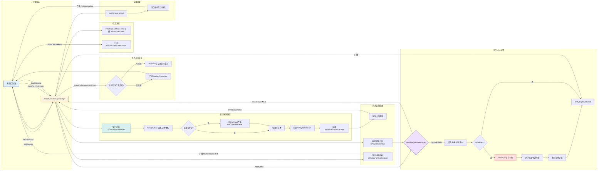

## 📖 简介

### 🛠️ 技术栈

UE5 C++

BluePrints

UMG

SVN

### 🔗 项目链接

[https://store.steampowered.com/app/3552700/\_/](https://store.steampowered.com/app/3552700/_/) 现已开放愿望单

### ✨ 技术亮点与职责

- 基于[Dialogue Builder插件](https://www.fab.com/listings/052820ab-f423-48e8-978a-eefd4087b1a4?lang=zh-cn)进行二次开发，协同文案策划构建支持富文本打字机、动态分支选项、技能检定提示与音效联动的完整对话UI框架。
- C++ 底层逻辑：扩展 DialogueBubbleWidget、OptionButtonWidget、MainDialogueWidget 等核心类，实现逐字打印、富文本标签无截断渲染、统一打字速度及标点停顿倍率，大幅提升剧情演出节奏感。
- 分支选项系统：设计并实现单/多选项弹出、选项后自动衔接NPC侧对话的完整分支逻辑；通过合理数据结构约定，简化蓝图流程，消除分支判定的冗余数组操作，显著降低维护成本。
- 辅助功能：集成节点驱动的打字音效自动播放/停止，沉浸式赛博叙事体验。

## 🎮 实现思路及演示

因为策划找到我时，这个项目已经是完成度很高的作品，所以我的任务就是在原来的庞然巨物上做功能调优和新增功能（作为一个纯蓝图项目，代码可读性极差，调断点的时候一直在四个文件里面反复跳）

  

    
    
📑 策划需求

  

  

    
    
直面蓝图古神来了

  

  

    
    
改了三版

  

### 对话系统

在重构前，原对话系统采用「显示一条清一条」的机制，玩家无法回顾历史对话以及已选分支选项，严重削弱赛博朋克题材的剧情沉浸感。因此本次重构核心目标：**打造可追溯、动态检定、富有节奏的叙事UI框架**，并对接 Dialogue Builder 插件实现节点化驱动。

✨ 重构策略：

- **历史记录组件**：采用环形队列存储气泡实例，支持滚动回溯，玩家可在对话间隙翻看之前文本。
- **统一打字机控制器**：支持富文本标签延迟解析，标点符号自动停歇，音效逐字匹配。
- **选项-检定联动**：选项按钮根据数据驱动显示技能类型及风险等级，UI面板动态刷新掷骰反馈。
- **模块化事件广播**：解耦 C++ 与蓝图，选项选择、对话结束、检定进入等事件均通过动态多播驱动，策划可灵活配置。

#### 系统逻辑图

对话系统实机演示

<figure class="video-card">
  <video controls muted loop preload="auto">
    <source src="/video/dialogue-demo.mp4" type="video/mp4" />
    您的浏览器不支持视频播放，请升级浏览器或查看项目文档。
  </video>
  <figcaption class="video-desc">🎞️ 对话系统演示视频 | 动态选项 + 逐字演出 + 技能检定</figcaption>
</figure>

### 玩家交互

这个最简单了，

### 文本收集系统

同理剧情对话系统，玩家收集到的线索没有回顾功能

### 教程系统

这还是我第一次接触UE MediaSource 相关的内容，还好文档够多
